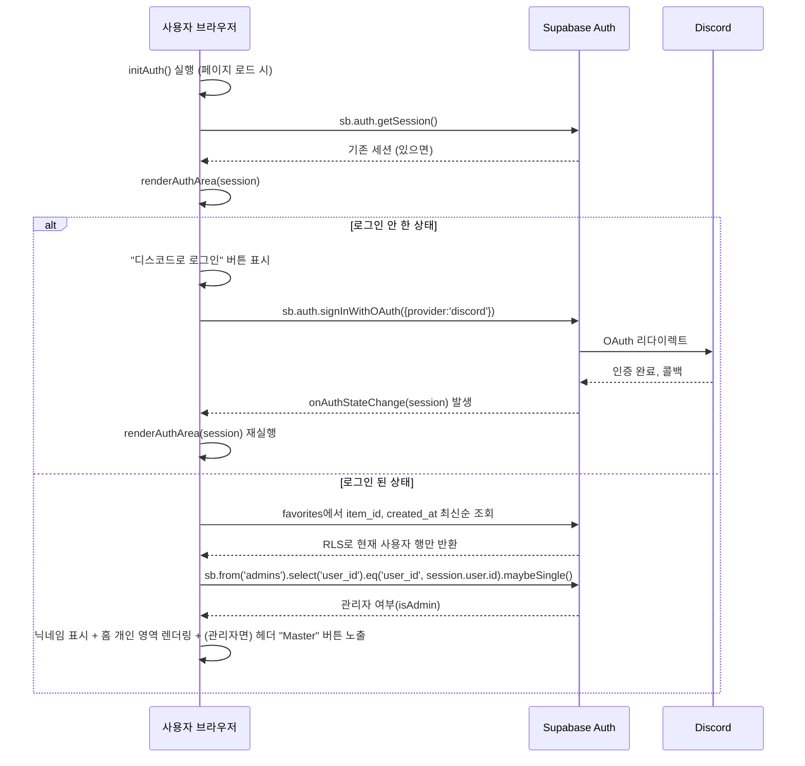

# ARCHITECTURE.md

> 실제 코드를 분석해서 작성한 구조·흐름 문서.
> (구 PROJECT_STRUCTURE.md / docs/architecture/auth-flow.md / search-flow.md / admin-flow.md / database-flow.md 통합, 2026-08-04)

이 프로젝트는 별도의 빌드 시스템이나 프레임워크 없이 HTML/CSS/JavaScript 정적 파일 3개로 이루어진 사이트다.

---

# 1. 폴더/파일 구조

```
sudden-archive/                     (이 저장소, User 사이트 — github.com/K-Hena/sudden-archive)
├── index.html                      User 사이트 마크업 + head 테마 선적용 스크립트
├── styles.css                      User 사이트 전체 스타일
├── app.js                          User 사이트 전체 JavaScript 동작(전역 스크립트)
├── favicon.ico / favicon-16.png / favicon-32.png / favicon-192.png / apple-touch-icon-180.png
├── .gitignore
├── CLAUDE.md                       Claude Code 진입 문서 (docs/AI_CONTEXT.md로 안내)
├── CLAUDE.local.md                 개인 전용 로컬 메모, git 추적 제외 (.gitignore)
├── AGENTS.md                       범용 AI 에이전트(Codex 등) 온보딩 문서
├── .github/
│   └── copilot-instructions.md     GitHub Copilot용 규칙 요약
├── tests/
│   ├── channel-name.test.js        유튜브 채널명 수집·저장 최소 테스트
│   ├── clip-preview.test.js        클립 미리보기 구간 감시 최소 테스트
│   ├── favorites.test.js           즐겨찾기 정렬/버튼 로직 최소 테스트
│   └── volume-persistence.test.js  클립 범위·볼륨 저장 최소 테스트 (각 테스트는 node로 직접 실행)
├── .claude/                        Claude Code 설정 — settings.json 등은 git에 커밋되어(공유) 팀 전체에 적용됨, settings.local.json만 개인용(git 미추적)
│   ├── settings.json                PostToolUse/PreToolUse 훅 등록, permissions
│   ├── settings.local.json          개인 permissions/language 설정 (git 미추적)
│   ├── hooks/block-db-commands.sh   Bash로 DB CLI 직접 실행(psql, supabase db push 등) 차단
│   ├── rules/db.md                  SQL 실행 위험도 규칙
│   ├── agents/                      code-reviewer.md, bug-hunter.md
│   ├── commands/commit.md           `/commit` 슬래시 커맨드
│   └── output-styles/terse.md       응답 스타일 설정
└── docs/                           AI 운영 문서 (이 문서들)
    └── LLM_WIKI.md                 LLM용 작업별 코드·문서 라우팅 허브
```

별도 `sudden-archive-admin` 저장소와 Vercel 프로젝트는 Master 대시보드로 기능을 통합한 뒤 2026-08-04 삭제했다. 현재 배포되는 저장소와 사이트는 `sudden-archive` 하나다.

CDN으로 불러오는 외부 자원: `@supabase/supabase-js@2`, `cropperjs@1.6.1`(이미지 크롭, 레거시 Admin과 동일 버전), `@tabler/icons-webfont@3.31.0`(아이콘 시스템 통일, 웹폰트 방식 `<i class="ti ti-이름">`), YouTube IFrame API(`https://www.youtube.com/iframe_api`, 클립 구간 재생/마킹용), Pretendard와 조선굴림체 웹폰트. Paperlogy는 저장소의 기존 폰트 역할을 유지한다.

---

# 2. index.html 내부 구성 (CSS/HTML/JS)

`index.html`이 `styles.css`와 `app.js`를 각각 `/styles.css`, `/app.js`로 불러온다. Vercel은 세 파일을 하나의 정적 배포로 함께 제공하며 별도 빌드 설정은 없다.

## CSS (`styles.css`)
- `:root`에 색상 변수 정의: `--bg/--panel/--line/--text/--muted` (베이스), `--red/--blue` (팀 컬러), `--amber` (즐겨찾기 별 등에 사용), `--edit-accent/--edit-accent-ink` (Master 버튼·탭·강조 요소 전용 강조색), `--green` (성공 메시지)
- 컴포넌트별 스타일: 헤더/브랜드, 홈 대시보드(`home-*`), 맵 그리드(`map-tile`), 검색창(`detail-search`)과 전체 맵·상세 상단 검색 행(`map-head`, 모바일 세로 배치), 카드 그리드(`card`, `card-fav`, 작성자 표시), 재생 오버레이(`overlay`, 댓글·이미지 확대/이동), Master 대시보드(`master-shell`, `master-sidebar`, `master-tab`, `master-content`, `master-pane`, `master-table`, `master-view-switch`), 컨텐츠 추가 모달(`modal`, `type-toggle`, `cropper-wrap`, `clip-tools`, `clip-btns`, `clip-range`), 구간 슬라이더(`clip-sliders`, `clip-range-slider`/`clip-range-track`/`clip-range-fill`/`clip-range-input`)
- 기본 본문·UI는 Pretendard, 댓글은 조선굴림체를 사용한다. Paperlogy 제목과 Rajdhani/JetBrains Mono의 영문·숫자 역할은 유지하되 한글 fallback은 Pretendard다.
- 과거 편집모드 전용이었던 `tile-actions`/`add-tile`/`editmode-btn`/`admin-badge`/`card-edit`/`card-del`/`card-fav.with-delete`는 그룹 D-2 4단계에서 기능과 함께 CSS도 완전히 삭제됨

## HTML (`index.html`)
- `<head>`: 메타데이터, 파비콘, Supabase/Cropper/Tabler Icons CDN, `/styles.css`. `sa-theme`을 DOM 렌더 전에 적용하는 짧은 인라인 스크립트는 테마 깜빡임 방지를 위해 의도적으로 유지
- `header`: 로고, CLIPS/TIPS 카운트, `#authArea`(로그인 상태에 따라 JS가 채움)
- `.subbar`: 전체 맵 / 현재 맵 이름 breadcrumb
- `#viewHome`: 로그인 여부와 관계없는 첫 화면 — 승인된 컨텐츠로 가는 전체 맵 CTA, 즐겨찾기·최근 본 컨텐츠, 컨텐츠 추가·임시저장, 내가 추가한 컨텐츠 영역
- `#viewGrid`: 맵 선택 화면 — 맵 선택 문구와 전체 제목 검색창(`#globalTitleSearch`) 아래 `#mapGrid`에 맵 타일 또는 검색 결과 카드 표시
- `#viewDetail`: 맵 상세 화면 — 상단 `map-head detail-toolbar` 안에 뒤로가기 버튼(왼쪽)과 제목 검색창(`#titleSearch`, 오른쪽), 그 아래 맵 제목·RED/BLUE 팀 토글과 `#cardGrid`
- `#overlay`: 영상/이미지 재생 오버레이 — 실제 미디어(iframe/img)는 `#overlayMediaContent`에만 그리고, 그 위에 뜨는 재생/일시정지 버튼(`#overlayPlayPause`)과 클립 항목 전용 "전체 영상 보기" 버튼(`#overlayFullBtn`)은 형제 요소로 분리해 `innerHTML` 교체로 지워지지 않게 함
- `#addModal`: 컨텐츠 추가/수정 모달(홈에서 진입) — `#pasteStep` → `#targetStep`(맵 드롭다운 + 태그 타일) → `#videoWrap/#imageWrap` → `#titleWrap` 4단계 화면 전환. 유튜브 URL/이미지를 자동 판별하고, 이미지는 Cropper.js, 영상은 `#clipTools`(버튼 + 슬라이더)로 연결. "맵 지명" 태그는 이미지 고정이며 관리자만 추가 가능
- `#mapImgInput`: 맵 이미지 업로드용 숨김 `<input type=file>`
- `#viewMaster`: 관리자 전용 Master 대시보드 — `.master-sidebar`(통계/항목 관리/맵 관리/댓글/승인 대기 5탭) + `.master-content`(탭별 `.master-pane`, `switchMasterTab()`으로 표시만 전환하고 DOM은 항상 유지). 항목 관리는 `masterItemsView`로 활성/휴지통을 전환
- `</body>` 직전 `/app.js`: DOM이 모두 만들어진 뒤 기존 전역 스크립트를 같은 시점에 실행. 인라인 `onclick` 42개가 전역 함수 선언에 의존하므로 `type="module"`을 사용하지 않음

## JavaScript (`app.js`)
- Supabase 클라이언트 초기화 (`sb`)
- 전역 상태: `maps`, `items`, `currentMap`, `currentMapName`, `currentTeam`, `currentSession`, `favorites`, `favoritePending`, `isAdminUser`, `masterItemsView`, `modalTag`, `modalType`, `modalStep`, `cropper`, `pendingMapId`, `clipStart`, `clipEnd`, `clipDuration`, `clipYtPlayer`(재생 오버레이용 `ytPlayer`와는 별도 — `docs/DECISIONS.md` 참고), `clipPreviewTimer`(편집 미리보기 구간 감시 전용, 일반 오버레이 `clipTimer`와 분리), `clipScrubLastSeek`(드래그 스크러빙 스로틀용)
- 데이터 로드: `loadAll()` — `maps`/`items` 테이블을 조회해 전역 배열을 채우고 홈·전체 맵을 갱신. 공개 화면은 `publicItems()`로 `published`만 사용하며, Master 화면이 활성이면 현재 탭에 맞는 렌더 함수도 호출
- 맵 그리드: `renderMapGrid()`는 검색어가 없으면 맵 타일을, 있으면 `renderGlobalTitleSearch()`를 통해 공개 항목의 제목·채널명 검색 결과를 표시. 맵 CRUD 함수 `addMap()/renameMap()/deleteMap()/pickMapImage()`는 Master "맵 관리" 탭에서만 호출됨
- 상세 카드: `renderCards()`가 현재 맵·팀과 제목·채널명으로 공개 항목을 필터링한 뒤 위폭·팁 즐겨찾기를 최신순 우선 정렬(액션 아이콘 없음, 관리자·비관리자 동일). `favoriteButton()/toggleFavorite()`가 상세·전체 검색 카드의 별 버튼과 DB 성공 후 상태 갱신을 담당하고 `favoritePending`으로 중복 요청을 차단. 컨텐츠 추가는 홈에서 같은 모달을 사용하고, 일반 사용자는 위폭·팁만 선택할 수 있다. 수정·관리자 휴지통 이동은 Master 항목 관리 또는 본인 컨텐츠 흐름에서 권한에 맞게 진입한다.
- 클립 구간 지정: `loadClipPlayer()/markClipStart()/markClipEnd()/clearClip()/updateClipLabel()`(버튼), `onClipStartInput()/onClipStartChange()/onClipEndInput()/onClipEndChange()/syncClipSliders()/updateClipSliderLabels()/updateClipRangeFill()`(단일 트랙 슬라이더 — `min`/`max`는 항상 `[0, clipDuration]`로 고정, 교차 방지는 각 입력 핸들러가 자기 자신의 value만 clamp하는 방식), `onClipScrubStart()/scrubClipPreview()`(드래그 중 일시정지 + 스로틀된 정지 프레임 미리보기), `applyClipDuration(duration)`(`getDuration()`이 안정된 값으로 확정됐을 때만 슬라이더 `min`/`max`/`value`에 반영 — 모달 초기화 시 `0`으로도 호출해 이전 영상 상태를 리셋), `syncClipPreviewTimer()/stopClipPreviewTimer()`(양쪽 경계가 있을 때만 `[clipStart, clipEnd)` 감시, 초기화·영상 교체·이미지 전환·모달 종료 시 정리) — 버튼과 슬라이더 모두 `clipStart`/`clipEnd`를 공유
- 재생: `openOverlay()/closeOverlay()` — 유튜브 IFrame API로 클립 구간 반복 재생 지원, 클립 항목은 `controls:0`으로 컨트롤바를 숨기고 `toggleOverlayPlay()`(커스텀 재생/일시정지)와 `showFullVideo()`(같은 위치에서 이어서 `controls:1` 플레이어로 재생성, 구간 제한 해제)를 제공. 상태는 `overlayVideoId`/`overlayHasClip`에 저장되며 오버레이를 닫으면 초기화됨(전체 모드 전환은 세션 한정, `docs/DECISIONS.md` 참고)
- 인증·홈: `initAuth()/renderAuthArea()/discordLogin()/loadFavorites()/showHome()/renderHomeDashboard()` — Discord OAuth, 즐겨찾기·최근 본 컨텐츠·임시저장·본인 등록 목록을 로그인 상태에 맞게 렌더링하고 `admins` 조회 결과로 `#masterBtn` 노출 여부 결정
- 사용자 등록: 일반 사용자는 위폭·팁만 `pending`, 관리자는 맵 지명을 포함해 `published`로 저장. 작성자 표시 정보는 DB 트리거가 Discord 인증 메타데이터로 강제하며, 일반 사용자는 승인 전 항목만 수정·숨김 가능
- Master 대시보드: `openMaster()/switchMasterTab()` — 통계·항목 관리·맵 관리·댓글·승인 대기 탭 전환. `renderMasterApprovals()/reviewItem()`이 승인·반려를, `moveItemToTrash()/restoreItem()`이 휴지통 이동·원래 상태 복구를 담당

---

# 3. 전체 흐름 요약

## 비로그인 / 일반 로그인 사용자
```
initAuth() + loadAll() 동시 시작
  → 홈 표시 → 전체 맵 보기 CTA
  → loadAll(): maps/items 테이블 SELECT → 공개 화면은 published만 사용
  → 맵 타일 클릭 → openMap() → renderCards() (팀 필터 + 태그별 그룹핑)
  → 카드 클릭 → openOverlay() (유튜브 임베드 또는 이미지 표시)
```
관리자로 로그인해도 이 화면(맵 그리드·카드 그리드)의 모습은 동일하다 — CRUD 액션이 전혀 섞여 들어가지 않는다.

## 로그인 + 관리자 (Master 대시보드)

로그인 → 관리자 판별 → Master 진입의 자세한 흐름은 아래 "4. 인증(Auth) 흐름"을,
Master에서 실제로 어떤 CRUD가 이식/미이식 상태인지는 아래 "6. 관리자(Admin) 흐름"을 참고한다.
여기서는 데이터가 화면과 어떻게 얽혀 있는지만 짚는다: 맵/항목 CRUD 액션(맵 이미지 변경/이름 변경/삭제/추가, 항목 추가/수정/삭제)은
전부 `#viewMaster`(Master 대시보드) 안에서만 발생하며, Supabase에 쓴 뒤 항상 `loadAll()`로
전체 목록을 다시 불러와 화면을 갱신하는 패턴을 공유한다 (부분 갱신 없음, 아래 "7. 데이터베이스 흐름" 참고).

## 브라우저 히스토리(뒤로가기)

홈/전체 맵/맵 상세/항목 오버레이/Master 5개 화면을 각각 하나의 `history` 항목으로 취급한다. URL은 바뀌지 않는다 — `pushState(state, '', location.href)`로 상태 객체만 쌓는 방식이라 딥링크(주소로 특정 화면 바로 열기)는 지원하지 않는다.

- 진입 함수(`showHome`/`showMapGrid`/`openMap`/`openMaster`/`openOverlay`)가 각자 `pushViewState({view:'...', ...})`를 호출해 상태를 쌓는다. `pushViewState()`는 `history.state`와 새 상태가 완전히 같으면(같은 화면을 다시 연 경우, 예: 홈에서 로고를 다시 클릭) push를 생략해 중복 항목을 막는다.
- 맵 상세(`detail`) 상태에는 `mapId`/`mapName`/`team`을 함께 담는다. 팀 전환(`setTeam()`)은 범위 확정에 따라 별도 항목이 아니라 `history.replaceState()`로 현재 맵 상세 항목의 `team`만 갱신한다 — `openMap()`이 먼저 push한 뒤 `setTeam('total')`을 호출하는 순서라, `setTeam()`은 항상 이미 push된 detail 항목을 replace한다.
- Master 대시보드 내부 탭 전환(`switchMasterTab()`)은 history를 건드리지 않는다 — Master 진입/이탈만 한 단계다.
- `window.addEventListener('popstate', ...)`가 `event.state`를 읽고 같은 진입 함수를 재사용해 화면을 복원한다. 복원 중에는 모듈 플래그 `restoringFromHistory`를 true로 세팅해(try/finally로 보장) 각 함수 내부의 `pushViewState`/`replaceState` 호출이 다시 history를 쌓지 않게 막는다. `overlay` 상태 복원은 반드시 `openOverlay(itemId, false)`로 호출해 조회수·최근 본 컨텐츠 기록이 중복되지 않게 한다.
- popstate가 뜨면 먼저 `#addModal`이 실제로 열려 있는 경우에만 `requestCloseModal()`을 호출해 정리한다(모달은 히스토리에 없으므로 "모달만 닫고 화면 유지"는 불가능하고, popstate 시점엔 이미 배경 화면이 바뀌는 게 확정이다 — 작성 중 입력이 있으면 기존과 동일하게 임시저장 여부를 묻는다). `hasModalUnsavedInput()`은 모달이 열려 있는지 자체를 보지 않고 필드 값·모드만 보므로, 모달이 닫힌 뒤에도 정리되지 않은 이전 입력값이 남아 있으면 이 호출을 무조건 하는 경우 무관한 화면 전환에서까지 임시저장 프롬프트가 뜨거나 유령 임시저장이 생길 수 있다 — 그래서 `active` 클래스를 먼저 확인한다. 그다음 `state.view`가 `overlay`가 아니면 `closeOverlay()`로 오버레이도 정리한 뒤 대상 화면을 복원한다.
- "뒤로가기류" UI(오버레이 "닫기 ✕", 맵 상세 "← 전체 맵으로", Master 각 탭의 "← 이전 화면으로")는 화면 전환 함수를 직접 호출하는 대신 `history.back()`을 호출한다. 직접 호출로 두면(예: 닫기 버튼이 `closeOverlay()`를 직접 호출) 버튼 클릭과 브라우저 뒤로가기가 서로 다른 항목을 소비/생성해 스택이 어긋난다(버튼으로 닫은 뒤 뒤로가기를 누르면 방금 닫은 화면이 다시 열리는 등). Master의 "← 일반 화면으로"/"← 홈으로" 버튼은 Master가 home/grid/detail 어디서든 진입 가능해 고정 목적지를 보장할 수 없어 라벨을 "← 이전 화면으로"로 바꿨다(`docs/DECISIONS.md` 참고). 헤더 로고("홈으로 이동")는 back-btn류가 아니라 항상 홈으로 가는 유틸리티라 `showHome()` 직접 호출을 그대로 유지한다.
- 세션 만료 등으로 관리자 권한을 잃어 Master에서 강제 이탈시키는 기존 안전장치(`renderAuthArea()`의 `!isAdminUser && viewMaster.active` 분기)는 `showMapGrid()`를 `restoringFromHistory=true`로 감싸 호출한 뒤 현재 항목을 `{view:'grid'}`로 `replaceState`한다 — 실제 사용자 탐색이 아니므로 새 항목을 쌓지 않는다.

---

# 4. 인증(Auth) 흐름

> 현재 인증과 운영 기능은 User 사이트의 Discord 로그인 + Master로 통합됐다. 아래 레거시 설명은 삭제 전 이관 근거를 요약한 기록이다.

## User 사이트 — Discord OAuth (현재 방식)



## 코드 위치 (`index.html`)
- `initAuth()`: 페이지 로드 시 세션 확인 + `onAuthStateChange` 구독 등록
- `renderAuthArea(session)`: 세션 유무에 따라 로그인 버튼 / 닉네임+로그아웃 버튼 렌더링. 로그인 상태면 `admins` 테이블을 조회해 `isAdminUser`를 갱신하고, 그 값으로 헤더 `#masterBtn`(Master 대시보드 진입 버튼)의 노출 여부를 결정
- 로그인: `sb.auth.signInWithOAuth({ provider: 'discord' })`
- 로그아웃: `sb.auth.signOut()`
- 닉네임: `session.user.user_metadata.full_name || session.user.user_metadata.name || '사용자'`
- 즐겨찾기: 로그인 시 `favorites`를 최신순 조회하고 로그아웃 시 세션·즐겨찾기·처리 중 상태를 즉시 비운 뒤 현재 화면을 다시 렌더링한다.
- 홈 개인 영역: 로그인 상태에 따라 즐겨찾기·최근 본 컨텐츠·컨텐츠 추가·임시저장·내가 추가한 컨텐츠를 렌더링한다. 비로그인 상태에서는 로그인 필요 안내를 표시한다.

## 관리자 판별 → Master 대시보드
- `renderAuthArea`가 `admins` 테이블에서 `user_id` 존재 여부로 `isAdmin`을 판별해 전역 `isAdminUser`에 반영한다.
- `isAdminUser`면 헤더에 "Master" 버튼(`#masterBtn`)이 나타나고, 클릭 시 `openMaster()`가 `#viewMaster`(사이드바 탭 + 콘텐츠)를 연다. 이전에는 같은 화면에서 `editMode`를 토글해 카드·맵 타일에 액션을 노출하는 방식이었지만, 그룹 D-2 4단계에서 `editMode` 전역 변수와 `toggleEditMode()` 자체가 삭제되고 별도 Master 대시보드 방식으로 대체됐다(아래 "6. 관리자(Admin) 흐름" 참고).
- `isAdminUser`는 **클라이언트 상태일 뿐**이며, 실제 쓰기 권한은 Supabase RLS가 `admins` 테이블 기준으로 강제한다(→ `DATABASE.md`). 즉 `isAdminUser=true`로 Master 버튼이 보여도 RLS를 통과하지 못하면 실제 insert/update/delete는 실패한다.
- 로그아웃하거나 세션이 없어지면 `isAdminUser`가 `false`로 갱신되고, Master 화면을 보고 있었다면 `showMapGrid()`로 강제 이동한다.

## 삭제된 레거시 인증

구 Admin은 이메일/비밀번호 로그인을 사용했으나 Discord 로그인 기반 Master로 대체됐다. 사이트·저장소 삭제 후 현재 인증 경로에서는 사용하지 않는다.

---

# 5. 탐색/검색 흐름

## 공용 매칭 함수: `matchesSearch()`

전체 검색(`renderGlobalTitleSearch`)과 맵·팀 내 검색(`renderCards`) 모두 `matchesSearch(fields, query)`(2단계 도입) 하나를 공유한다. 두 경로 모두 대상 필드를 `[title, channel_name, note, contributor_name]` 배열로 넘긴다.

- `isPureChosung(query)`가 `true`(검색어가 `ㄱ`~`ㅎ`(U+3131~U+314E) 자음 문자로만 구성된 "순수 초성"인 경우)이면, 네 필드 각각을 `toChosung()`으로 초성만 추출한 뒤 검색어와 부분 일치시킨다. 완성형 글자나 숫자/영문이 하나라도 섞이면 순수 초성이 아니므로 이 분기는 시도하지 않는다.
- 그 외(순수 초성이 아닌 모든 검색어)에는 기존 1단계 로직 그대로 — 대소문자 무시, 부분 일치.
- `toChosung()`은 완성형 한글 음절(가~힣, U+AC00~U+D7A3)만 초성으로 변환하고, 그 외 문자(자음 낱자, 영문, 숫자, 공백 등)는 원문 그대로 통과시킨다.
- 네 필드 모두 `null`이면 두 분기 모두에서 자연히 매칭에서 제외된다 — 맵 지명 항목은 `note`가 항상 `null`로 저장되고, 레거시 항목은 `contributor_name`이 `null`일 수 있다.

## 자동완성 드롭다운 (3단계)

두 검색 입력 모두 입력창 아래 `.search-wrap > .search-dropdown`에 실시간 미리보기 드롭다운을 갖는다. 메인 결과 목록(`renderGlobalTitleSearch`/`renderCards`)의 즉시 필터링은 그대로 유지되고, 드롭다운은 별도 경로(`onSearchDropdownInput` → 약 200ms 디바운스 → `renderSearchDropdown`)로 갱신된다.

- 후보 목록: 전체 검색 드롭다운은 `publicItems()`, 맵·팀 내 검색 드롭다운은 `renderCards()`와 동일한 `currentTeamItems()`(현재 map_id+team 필터, 즐겨찾기 포함)를 재사용한다.
- 매칭은 `matchesSearch()`를 그대로 재사용한다(초성 검색 포함, 새 매칭 로직 없음). 최대 6개(`SEARCH_DROPDOWN_LIMIT`)까지만 보여주고, 결과 0건이면 메인 목록과 동일한 "일치하는 항목이 없어요." 문구를 표시한다.
- 항목에는 제목과 보조 정보(맵 이름 + `channel_name`, 있는 것만)를 `escapeHtml()` 처리해 표시한다.
- 항목 클릭/탭 시 `selectSearchDropdownItem(id)` → 모든 드롭다운을 닫고 `openOverlay(id)`로 상세 오버레이를 바로 연다(카드 클릭과 동일 동작). 이 앱에는 별도 "검색 실행/제출" 동작이 없어 필터링·스크롤 방식은 채택하지 않았다(`docs/DECISIONS.md` 참고).
- PC: `ArrowDown`/`ArrowUp`으로 활성 항목 이동(기본 스크롤 동작은 `preventDefault()`로 막음), `Enter`로 선택, `Esc`로 드롭다운만 닫기(검색어는 유지).
- 모바일: 별도 키보드 네비게이션 없이 탭으로 바로 선택(클릭 이벤트로 통일 처리, 터치 전용 분기 없음).
- 검색어를 지우면(직접 입력이든 `clearTitleSearch()`/`clearGlobalTitleSearch()`를 통한 화면·팀 전환이든) 드롭다운은 예약된 디바운스 타이머까지 취소하고 즉시 닫힌다.
- 드롭다운 바깥 클릭 시 문서 레벨 클릭 리스너(`.search-wrap`에 속하지 않은 클릭)가 열려 있는 모든 드롭다운을 닫는다.
- 접근성: 입력에 `role="combobox"`/`aria-expanded`/`aria-controls`/`aria-activedescendant`, 드롭다운에 `role="listbox"`, 항목에 `role="option"`/`aria-selected`를 부여한다.

## 전체 맵 화면의 전체 검색

```
홈 → 전체 맵 보기
  → #viewGrid
#globalTitleSearch 입력
  → renderGlobalTitleSearch()
  → matchesSearch([title, channel_name, note, contributor_name], query) 필터
  → #mapGrid에 조회 전용 카드 렌더링
  → 카드 클릭 → openOverlay(id)
```

- 검색어는 `title`, `channel_name`(영상 항목만), `note`, `contributor_name` 중 하나라도 (순수 초성이면 초성 기준으로, 아니면 부분 일치 기준으로) 매칭되면 결과에 포함한다(그룹 E 2~3단계, 1·2단계 필드 확장·초성 검색).
- 결과 카드에는 기존 썸네일·유형 배지·제목·설명과 `maps` 배열에서 찾은 맵 이름, 진영을 표시한다. 영상이고 `channel_name`이 있으면 썸네일 좌하단에 채널 배지(`escapeHtml()` 처리)도 표시한다.
- 위폭·팁 결과에는 즐겨찾기 별 버튼을 표시하고, 즐겨찾기를 먼저(즐겨찾기끼리는 최신순) 정렬한다. 나머지 결과 순서는 유지한다.
- 검색어가 없으면 `renderMapGrid()`가 기존 맵 타일만 렌더링한다(관리자·비관리자 동일, 액션 아이콘 없음 — 맵 CRUD는 Master "맵 관리" 탭에서만 가능). 검색 결과 카드도 동일하게 액션이 없다.
- 맵을 열거나 전체 맵 화면으로 돌아오면 전역 검색어를 지우고 기존 맵 타일을 복원한다.

## 맵·팀 내 제목 검색

```
맵 선택 (#viewGrid, mapGrid)
  → openMap()에서 TOTAL 선택
  → TOTAL/RED/BLUE/FAVORITE 선택 (setTeam)
  → 제목 또는 채널 입력 (#titleSearch, input 이벤트)
  → renderCards()
      1. 현재 map_id + team 필터
      2. 검색어가 있으면 matchesSearch([title, channel_name, note, contributor_name], query) 필터
      3. 태그별 그룹핑 후 카드 렌더링
  → 카드 클릭 → openOverlay(id)
```

- 검색 범위는 현재 선택한 맵과 팀 안의 `items.title`, `items.channel_name`, `items.note`, `items.contributor_name`이다(그룹 E 2~3단계, 1·2단계 필드 확장·초성 검색). 태그, 맵 이름, 영상 URL은 여전히 검색하지 않는다.
- 검색어의 앞뒤 공백을 제거하고 소문자로 변환한다(초성 판별·초성 변환은 대소문자와 무관). 순수 초성이면 초성 기준, 아니면 소문자 부분 일치 기준으로 네 필드를 비교한다. 필드가 `null`이어도 빈 문자열로 처리한다.
- `detailCount`는 검색 후 실제 표시되는 카드 수다.
- 검색어가 없고 데이터가 없으면 `이 진영에 등록된 항목이 없어요`, 검색 결과가 없으면 `일치하는 항목이 없어요`를 공용 빈 상태 템플릿(`emptyStateHtml()`)으로 표시한다.
- 다른 맵을 열거나 팀을 바꾸거나 전체 맵 화면으로 돌아가면 검색어를 초기화한다. Master에서 항목을 추가·수정·삭제한 뒤의 `loadAll()` 재렌더링에서는 유지한다.
- 위폭·팁 태그 안에서는 즐겨찾기를 먼저, 즐겨찾기끼리는 최신순으로 표시한다. 비즐겨찾기의 기존 순서와 태그 순서는 유지한다.

## 카드 배지 위계 / 빈 상태 / 아이콘

- **카드 배지**: 유형 배지(영상/이미지, `.badge.vid`/`.badge.img`)는 좌상단에 브랜드 핑크(`--edit-accent`) 실색으로, 쇼츠 배지는 그 아래(`top:28px`)에 세로로 쌓인다. 진영/공동 배지(`teamBadge()`, `renderCards()`에서만 호출)는 우상단 즐겨찾기 별 버튼 아래(`top:40px`)에 기존 진영색(RED/BLUE/무채색) 아웃라인 스타일로 표시된다. 전체 제목 검색·자동완성 드롭다운은 진영 정보를 배지가 아니라 텍스트로만 보여주므로 이 배지 재배치 대상이 아니다.
- **빈 상태**: 공용 함수 `emptyStateHtml(icon, headline, desc, buttonLabel, buttonOnclick)`이 아이콘+헤드라인+보조설명(선택)+바로가기 버튼(선택) 구조를 만든다. 홈 즐겨찾기/최근 본 컨텐츠/내가 추가한 컨텐츠, 전체·상세 검색 결과 없음, Master 승인 대기 없음 6곳에서 재사용한다.
- **아이콘**: `@tabler/icons-webfont` CDN(`<i class="ti ti-이름">`)으로 통일. 기존 이모지·유니코드 기호(📋🖼👑☆★✕✎⚙🗑🔒💬✅🗺📊🎯💡🔍⏸▶🔊🔇 등)를 전부 교체했고, `textContent`로 텍스트째 갈아끼우던 동적 토글(재생/일시정지, 음소거, 클립 재생 아이콘)은 `innerHTML`로 `<i>` 태그를 교체하는 방식으로 바꿨다. `←`/`−10`/`+10`(텍스트 라벨)과 `confirm()` 경고 문구의 이모지(HTML 렌더 불가)는 예외로 남겨뒀다.

## 미구현 범위

- 제목·채널명 외 설명·태그·맵 이름 검색
- 자동완성, 검색 기록, 초성·유사어 검색

---

# 6. 관리자(Admin) 흐름

> 관리자 기능은 User 사이트의 Master 대시보드 한 곳에만 존재한다. 레거시 Admin의 CRUD·크롭·클립 구간 지정 기능은 이관 검증 후 사이트와 저장소를 삭제했다.

## User 사이트 Master 대시보드 (`index.html`, 맵/항목 CRUD 이식 완료)

로그인 + `admins` 테이블 등록 여부로 관리자를 판별한다(위 "4. 인증(Auth) 흐름" 참고). 관리자면 헤더에 "Master" 버튼이 노출되고, 클릭하면 `#viewMaster`(사이드바 탭 + 콘텐츠)로 전환된다(`openMaster()`). 일반 사용자가 보는 맵 그리드·카드 그리드 화면에는 CRUD 액션이 전혀 섞여 들어가지 않는다 — **과거에는 같은 화면에서 `editMode` 토글로 액션을 켜고 끄는 방식이었지만, 그룹 D-2 4단계에서 이 방식을 완전히 폐기하고 지금의 별도 Master 대시보드 방식으로 바꿨다.**

### Master 사이드바 탭 (현재 5개)
- **통계**: 항목별 클릭수·즐겨찾기 집계 테이블(그룹 D-2 1단계)
- **항목 관리**: 맵/태그/진영 필터 + 제목 검색 + 테이블. `활성 항목/휴지통`을 전환하고 활성 행의 ⚙(수정)/🗑(휴지통 이동), 휴지통 행의 원래 상태·이동 시각·복구를 제공(그룹 D-2 3단계, F-6)
- **맵 관리**: 맵 목록 테이블, 각 행의 🖼(이미지 변경)/✎(이름 변경)/✕(삭제) 버튼이 기존 `pickMapImage()`/`renameMap()`/`deleteMap()`을 그대로 호출, 상단 "새 맵 추가" 버튼이 `addMap()` 호출(그룹 D-2 4단계)
- **댓글**: 전체 댓글을 `created_at` 내림차순으로 조회, `items[]`/`maps[]`에서 항목 제목·맵 이름 조회(삭제된 항목은 "삭제된 항목"), 맵 필터·검색(본문/작성자/항목 제목)은 클라이언트 사이드. "항목 보기"는 기존 `openOverlay()` 재사용, 삭제는 `deleteComment()`를 성공 여부(`boolean`) 반환하도록 최소 수정해 재사용(그룹 D-2 5단계)
- **승인 대기**: 일반 사용자가 등록한 `pending` 컨텐츠를 맵·태그 조합으로 필터링하고 결과 수·작성자·맵·태그·미리보기를 확인한 뒤 승인하거나 사유를 입력해 반려. 관리자 미리보기는 클릭수·최근 본 항목에 포함되지 않음(그룹 F-4)

### 항목 추가/수정 모달 (레거시 Admin에서 이식, 홈에서 진입)
- **붙여넣기 우선 4단계 모달** — `paste → target(맵·태그 선택) → media → details` 순서로 같은 모달 안에서 화면만 전환한다. 첫 화면은 `readAddClipboard()` 버튼과 이미지 업로드 링크만 노출하고, 자동 판별된 유튜브 URL/이미지는 각각 `modalType`만 정한 뒤 `enterAddTargetStep()`으로 넘어간다(영상 클립 플레이어는 `loadClipPlayer()`, 이미지 크롭은 Cropper.js를 media 단계 진입 시점에 생성 — 숨겨진 컨테이너에서 만들면 크기 계산이 틀어지기 때문). `target` 단계는 `maps[]`를 드롭다운으로, 태그는 F-6a 권한 로직을 그대로 재사용한 타일 버튼(`.paste-box` 스타일 재사용)으로 노출하고, 영상을 붙여넣은 경우 "맵 지명" 타일은 이미지 전용이라 숨긴다. 태그 타일 클릭(`confirmAddTarget()`)이 맵 선택 검증을 통과한 직후에만 `currentMap`/`currentMapName`/`modalTag`를 확정한다(드롭다운 `onchange`가 아님 — 단순 선택만으로 전역 내비게이션 상태가 바뀌는 것을 피하기 위해, Master 2단계와 동일한 논리). target/media/details 단계에는 뒤로가기를 제공한다(`target`→`paste`, `media`→`target`, `details`→`media`).
- **클립보드 자동 판별 + 폴백** — 사용자 클릭 안에서 `navigator.clipboard.read()`를 우선 호출해 `text/plain`은 `parseYouTube()`로 검증하고 이미지 MIME은 Cropper로 전달한다. API 미지원·권한 거부·빈 클립보드는 전용 입력 영역에 포커스를 주고 네이티브 `paste` 이벤트로 Ctrl+V를 받는다. "맵 지명"에서 URL을 붙여넣으면 이미지 전용 오류를 표시한다.
- **모든 태그의 이미지 업로드** — 붙여넣기 또는 "붙여넣지 않고 업로드" → Cropper.js로 크롭 → jpg blob 변환 → Storage `media`의 `items/{userId}/{timestamp}.jpg`에 업로드 → `img_url` 저장. 파일 선택은 `accept="image/*"`를 유지하고 GIF는 선택/붙여넣기 직후 명시적으로 거부한다.
- `submitItem()`이 `isMapLabel` 전용 분기가 아니라 레거시처럼 `modalType`(vid/img) 기준으로 일반화됨
- **개별 항목 휴지통·복구** — `moveItemToTrash()`가 행을 `trashed`로 전환하고 `restoreItem()`이 DB 트리거가 기록한 `trashed_from_status`로 복구한다. 영구 삭제 UI와 Storage 정리는 이번 범위에 없음
- **클립 구간(`clip_start`/`clip_end`) 마킹** — 레거시의 `loadClipPlayer()`/`markClipStart()`/`markClipEnd()`/`clearClip()`/`updateClipLabel()`을 버튼 방식 그대로 이식. 레거시에는 없던 **슬라이더 UI**(`<input type=range>` 2개, 시작/끝)를 추가로 도입해 드래그로도 구간 지정이 가능하다. 버튼/슬라이더 모두 같은 `clipStart`/`clipEnd` 전역 변수를 공유해 항상 동기화됨(`docs/DECISIONS.md` 참고). `submitItem()`이 `modalType==='vid'`일 때 이 값들을 그대로 저장한다(더 이상 항상 `null`이 아님)
- 모달의 클립 플레이어는 오버레이 재생용 `ytPlayer`와 이름이 겹치지 않도록 `clipYtPlayer`라는 별도 변수로 분리 (재생 중인 유튜브 IFrame API 로드 자체는 오버레이 코드와 공유)
- **저장된 항목 수정** — 레거시 Admin에는 없던 새 기능(포팅이 아님). Master "항목 관리" 탭의 ⚙ 아이콘 → `openEditModal()`이 기존 항목 추가 모달을 `modalMode==='edit'`로 열어 제목·설명·진영·(영상이면) 클립 구간만 수정한다. 태그·타입·이미지·영상 URL은 읽기전용/변경불가로 표시하고 삭제 후 재등록을 안내. `submitItem()`이 수정 모드에서는 `insert` 대신 `update()`를 호출한다. 세부 결정은 `docs/DECISIONS.md` 참고

### 폐기된 방식 — 카드/맵 타일 호버 편집모드 (그룹 D-2 4단계에서 완전 제거)
과거에는 `editMode` 전역 변수(관리자가 헤더 "편집모드" 버튼으로 토글)에 따라 `renderMapGrid()`/`renderCards()`가 맵 타일 호버 액션·"맵 추가" 타일·카드의 ⚙/✕ 아이콘·"+추가" 타일을 조건부로 문자열에 끼워 넣는 방식이었다. 지금은 `editMode` 변수 자체가 코드에서 삭제됐고, 위 CRUD는 전부 Master 대시보드 탭을 통해서만 가능하다 — 일반 사용자가 보는 화면과 관리자가 보는 일반 화면(맵 그리드·카드 그리드)은 이제 완전히 동일하다.

## 관리자 통합 완료

Master 대시보드가 레거시 Admin의 맵/항목 CRUD·이미지 크롭·영상 클립 구간 지정을 모두 흡수했다. 기능 격차 없음과 최종 회귀를 확인한 뒤 구 Admin의 Vercel 프로젝트·GitHub 저장소·로컬 복제본을 삭제했다.

---

# 7. 데이터베이스 흐름

> `DATABASE.md`가 테이블/컬럼을 다룬다면, 이 섹션은 **데이터가 실제로 어떻게 오가는지**(쓰기 → 반영 → 조회)를 코드 기준으로 정리한다.

## 전체 그림

```
[User 사이트: 공개 화면 + 관리자 Master]
                  ↓
              Supabase
  - maps, items, admins, favorites, comments, item_clicks
  - media Storage 버킷
  - Discord OAuth
```

별도 백엔드 서버는 없고, 쓰기 권한 통제는 Supabase RLS가 담당한다.

## 조회(SELECT)

- `maps`는 누구나 조회한다. `items`는 RLS에 따라 비로그인은 `published`, 로그인 사용자는 `published`와 본인 항목, 관리자는 전체 상태를 조회한다. 공개 화면은 관리자 세션에서도 `publicItems()`를 거쳐 `published`만 렌더링한다.
- 조회 시점: 페이지 로드 시(`loadAll()`), 그리고 Master 대시보드에서 데이터를 변경할 때마다(`await loadAll()`)마다 **전체 목록을 다시 조회**한다.
- 홈/전체 맵 재진입, 브라우저 탭 복귀, 5분 주기에도 오래된 공개 데이터를 전체 재조회한다. 부분 조회나 Supabase Realtime 구독은 사용하지 않는다.

## 쓰기(INSERT/UPDATE/DELETE)

- `maps` 쓰기는 관리자만 가능하다. `items`는 일반 로그인 사용자도 본인 위폭·팁 `pending` 등록과 승인 전 수정·숨김이 가능하지만 맵 지명 등록·직접 승인·공개 항목 휴지통 이동·복구는 할 수 없고, 관리자는 전체 생명주기를 관리한다. 휴지통 이전 상태는 DB 트리거가 보존한다. `favorites`는 로그인 사용자 본인 행 중심의 별도 RLS를 쓴다 (`docs/DATABASE.md` 참고).
- `maps`/`items` 쓰기 흐름은 항상 **"Supabase에 직접 쓰기 → 성공하면 `loadAll()`로 전체 재조회"** 패턴이다. 낙관적 업데이트(Optimistic UI, 로컬 배열을 먼저 바꾸는 방식)는 쓰지 않는다. 예외: `favorites` 쓰기(`toggleFavorite()`)는 DB 성공 후 `loadAll()`을 다시 부르지 않고, 로컬 `favorites` 배열만 직접 갱신한 뒤 현재 화면을 다시 렌더링한다.
- 예: `renameMap()` → `sb.from('maps').update(...)` → 성공 시 `await loadAll()` → `maps`/`items` 전체 재조회 → `renderMapGrid()`

## 실시간 반영 범위에 대한 주의 (코드 확인 결과)

- 같은 브라우저 탭 안에서는 변경 직후 `loadAll()`이 실행되므로 바로 반영된다.
- 다른 사용자의 브라우저에는 Realtime으로 푸시하지 않는다. 대신 홈/전체 맵 재진입, 탭 복귀, 5분 주기 재조회 시 반영된다.

## Storage 쓰기 흐름

```
파일 선택/붙여넣기
  → Cropper.js로 자르기 → jpg blob 생성 (레거시 Admin, User 사이트 홈/Master의 `loadImageIntoCropper()`/`submitItem()` 모두 사용)
  → sb.storage.from('media').upload(path, file/blob)
  → sb.storage.from('media').getPublicUrl(path)
  → 반환된 공개 URL을 maps.img 또는 items.img_url 컬럼에 저장
```

Storage에 올라간 파일 자체는 별도 권한 체크 없이 공개 URL로 누구나 접근 가능하다는 전제 하에 동작한다 (버킷이 public read여야 프론트가 정상 표시됨 — 정확한 버킷 정책은 Supabase 대시보드 확인 필요).

---

# 8. 수정 시 주의사항

- **파일은 분리됐지만 전역 구조는 유지**: `maps`, `items`, `currentMap`, `currentTeam`, `isAdminUser` 등은 모두 `app.js` 최상단의 전역 변수다. 여러 렌더 함수와 `index.html`의 인라인 이벤트 속성이 이를 직접 참조한다. 파일 분리와 모듈화는 별개이므로, 새 기능을 작업하면서 임의로 ES Module·클래스·상태 관리 계층으로 바꾸지 않는다.
- **로드 순서 유지**: Supabase와 Cropper CDN → 본문 DOM → `/app.js` 순서다. `app.js`에 `defer`나 `type="module"`을 추가하거나 head로 옮기려면 인라인 이벤트와 초기화 시점을 별도로 검증해야 한다.
- **전역 상태 갱신**: 상태를 바꾸는 코드를 추가할 때는 관련 렌더 함수를 다시 호출해야 화면이 갱신된다 (예: `addMap()`/`moveItemToTrash()` 등이 성공 후 `loadAll()`을 호출해 공개 화면과 Master 활성 탭을 함께 갱신).
- **인라인 onclick과 함수명 결합**: 카드/타일 HTML은 템플릿 리터럴로 `onclick="함수명(...)"` 문자열을 직접 만든다. 전역 함수명을 바꾸면 HTML 문자열 안의 문자열도 함께 바꿔야 한다 — 타입 체커나 링터가 잡아주지 않는다.
- **문자열 이스케이프**: 맵/항목 이름에 작은따옴표(`'`)가 들어가면 onclick 인라인 속성이 깨지므로, `renderMapGrid()`에서 `m.name.replace(/'/g,"\\'")`로 이스케이프한 `safe` 값을 사용한다. 이름을 쓰는 새 UI를 추가할 때 이 패턴을 재사용해야 한다.
- **Supabase 에러 패턴**: 비동기 Supabase 호출은 예외를 던지지 않고 `{ data, error }`를 반환한다. 새 코드도 이 패턴(`if(error){ alert(...); return; }`)을 따라야 한다 — `DEVELOPMENT_GUIDE.md` 참고.
- **재생 오버레이의 YouTube 플레이어 정리**: `openOverlay()`를 다시 열거나 닫을 때 기존 `ytPlayer`/`clipTimer`를 정리하지 않으면 중복 재생/누수가 생긴다. 관련 코드를 건드릴 때는 이 정리 로직을 유지해야 한다.
