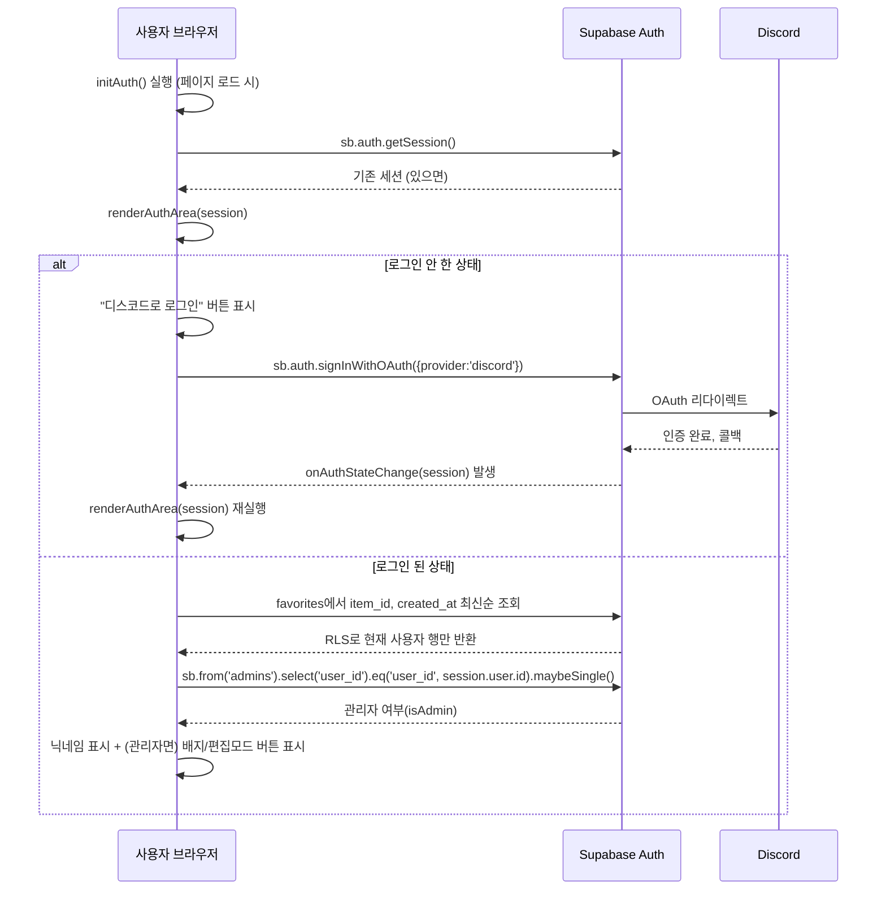

# auth-flow.md

> `index.html`(User)과 `sudden-archive-admin/index.html`(레거시 Admin)의 실제 인증 코드를 분석해서 작성했다. 두 사이트는 **서로 다른 로그인 방식**을 쓰고 있으며 아직 통합되지 않았다.

---

# User 사이트 — Discord OAuth (현재 방식)

## 코드 위치 (`index.html`)
- `initAuth()`: 페이지 로드 시 세션 확인 + `onAuthStateChange` 구독 등록
- `renderAuthArea(session)`: 세션 유무에 따라 로그인 버튼 / 닉네임+로그아웃 버튼 렌더링. 로그인 상태면 `admins` 테이블을 조회해 관리자 배지·편집모드 버튼도 추가
- 로그인: `sb.auth.signInWithOAuth({ provider: 'discord' })`
- 로그아웃: `sb.auth.signOut()`
- 닉네임: `session.user.user_metadata.full_name || session.user.user_metadata.name || '사용자'`
- 즐겨찾기: 로그인 시 `favorites`를 최신순 조회하고 로그아웃 시 세션·즐겨찾기·처리 중 상태를 즉시 비운 뒤 현재 화면을 다시 렌더링한다.

## 관리자 판별 → 편집모드
- `renderAuthArea`가 `admins` 테이블에서 `user_id` 존재 여부로 `isAdmin`을 판별한다.
- `isAdmin`이면 "편집모드" 버튼이 나타나고, 클릭 시 `toggleEditMode()`가 전역 `editMode` boolean을 반전시킨다.
- `editMode`는 **클라이언트 상태일 뿐**이며, 실제 쓰기 권한은 Supabase RLS가 `admins` 테이블 기준으로 강제한다(→ `DATABASE.md`). 즉 `editMode=true`로 UI가 열려도 RLS를 통과하지 못하면 실제 insert/update/delete는 실패한다.
- 로그아웃하거나 세션이 없어지면 `editMode`는 강제로 `false`로 리셋되고 화면이 다시 그려진다.

---

# 레거시 Admin 사이트 — 이메일/비밀번호 로그인 (폐기 예정)

`sudden-archive-admin/index.html`은 User 사이트와 완전히 별개의 인증 흐름을 쓴다.

- `checkSession()`: 세션이 있으면 `enterSite()`, 없으면 `showLogin()`
- 로그인 폼(`#loginView`)에서 이메일/비밀번호 입력 → `sb.auth.signInWithPassword({ email, password })`
- 로그아웃: `sb.auth.signOut()` 후 로그인 화면으로 복귀

이 사이트는 User 사이트에 편집모드가 완전히 이식되면 정리(폐기)될 예정이다 (`AI_CONTEXT.md`, `TODO.md` 참고). 새 기능은 이 흐름에 추가하지 않는다.

---

# 두 흐름이 같은 Supabase 프로젝트를 공유한다

두 사이트 모두 동일한 `SUPABASE_URL`과 anon key를 코드에 하드코딩해서 쓴다(코드로 확인됨). 다만 로그인 방식(Discord OAuth vs 이메일/비밀번호)이 다르면 Supabase Auth 상에서 별개의 `auth.users` 레코드로 취급되는 것이 일반적인 Supabase Auth 동작이므로, 같은 사람이 두 방식으로 각각 로그인하면 서로 다른 `user_id`를 갖게 될 수 있다 — 이는 Supabase Auth의 일반적 동작에 대한 설명이며, 이 프로젝트에서 실제로 계정 연결(link)을 하고 있는지는 코드로 확인되지 않았다. 향후 통합 시 `admins` 테이블에 어떤 `user_id`를 등록해야 하는지 결정할 때 확인이 필요하다.
