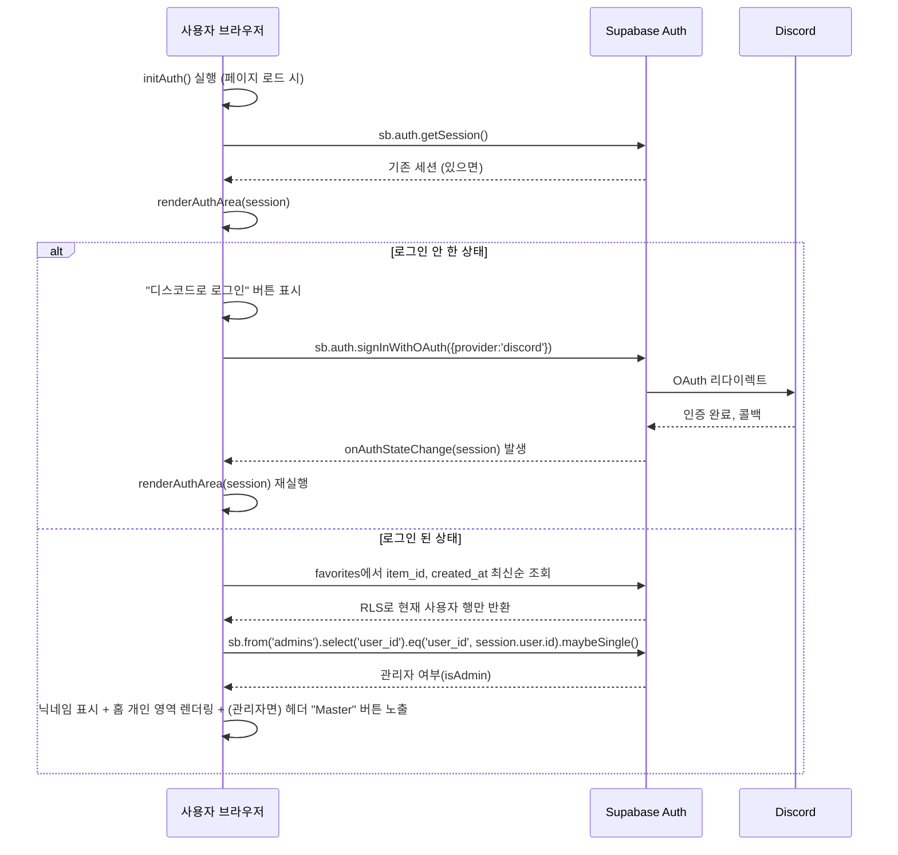

# auth-flow.md

> User 사이트의 `app.js`와 `sudden-archive-admin/index.html`(레거시 Admin)의 실제 인증 코드를 분석해서 작성했다. 두 배포는 서로 다른 로그인 방식을 쓰며, 운영 기능은 User 사이트의 Discord 로그인 + Master로 통합됐다.

---

# User 사이트 — Discord OAuth (현재 방식)

```mermaid
sequenceDiagram
    participant U as 사용자 브라우저
    participant S as Supabase Auth
    participant D as Discord

    U->>U: initAuth() 실행 (페이지 로드 시)
    U->>S: sb.auth.getSession()
    S-->>U: 기존 세션 (있으면)
    U->>U: renderAuthArea(session)

    alt 로그인 안 한 상태
        U->>U: "디스코드로 로그인" 버튼 표시
        U->>S: sb.auth.signInWithOAuth({provider:'discord'})
        S->>D: OAuth 리다이렉트
        D-->>S: 인증 완료, 콜백
        S-->>U: onAuthStateChange(session) 발생
        U->>U: renderAuthArea(session) 재실행
    else 로그인 된 상태
        U->>S: favorites에서 item_id, created_at 최신순 조회
        S-->>U: RLS로 현재 사용자 행만 반환
        U->>S: sb.from('admins').select('user_id').eq('user_id', session.user.id).maybeSingle()
        S-->>U: 관리자 여부(isAdmin)
        U->>U: 닉네임 표시 + 홈 개인 영역 렌더링 + (관리자면) 헤더 "Master" 버튼 노출
    end
```

## 코드 위치 (`index.html`)
- `initAuth()`: 페이지 로드 시 세션 확인 + `onAuthStateChange` 구독 등록
- `renderAuthArea(session)`: 세션 유무에 따라 로그인 버튼 / 닉네임+로그아웃 버튼 렌더링. 로그인 상태면 `admins` 테이블을 조회해 `isAdminUser`를 갱신하고, 그 값으로 헤더 `#masterBtn`(Master 대시보드 진입 버튼)의 노출 여부를 결정
- 로그인: `sb.auth.signInWithOAuth({ provider: 'discord' })`
- 로그아웃: `sb.auth.signOut()`
- 닉네임: `session.user.user_metadata.full_name || session.user.user_metadata.name || '사용자'`
- 즐겨찾기: 로그인 시 `favorites`를 최신순 조회하고 로그아웃 시 세션·즐겨찾기·처리 중 상태를 즉시 비운 뒤 현재 화면을 다시 렌더링한다.
- 홈 개인 영역: 로그인 상태에 따라 즐겨찾기·최근 본 컨텐츠·컨텐츠 추가·임시저장·내가 추가한 컨텐츠를 렌더링한다. 비로그인 상태에서는 로그인 필요 안내를 표시한다.

## 관리자 판별 → Master 대시보드
- `renderAuthArea`가 `admins` 테이블에서 `user_id` 존재 여부로 `isAdmin`을 판별해 전역 `isAdminUser`에 반영한다.
- `isAdminUser`면 헤더에 "Master" 버튼(`#masterBtn`)이 나타나고, 클릭 시 `openMaster()`가 `#viewMaster`(사이드바 탭 + 콘텐츠)를 연다. 이전에는 같은 화면에서 `editMode`를 토글해 카드·맵 타일에 액션을 노출하는 방식이었지만, 그룹 D-2 4단계에서 `editMode` 전역 변수와 `toggleEditMode()` 자체가 삭제되고 별도 Master 대시보드 방식으로 대체됐다(`docs/architecture/admin-flow.md` 참고).
- `isAdminUser`는 **클라이언트 상태일 뿐**이며, 실제 쓰기 권한은 Supabase RLS가 `admins` 테이블 기준으로 강제한다(→ `DATABASE.md`). 즉 `isAdminUser=true`로 Master 버튼이 보여도 RLS를 통과하지 못하면 실제 insert/update/delete는 실패한다.
- 로그아웃하거나 세션이 없어지면 `isAdminUser`가 `false`로 갱신되고, Master 화면을 보고 있었다면 `showMapGrid()`로 강제 이동한다.

---

# 레거시 Admin 사이트 — 이메일/비밀번호 로그인 (폐기 예정)

`sudden-archive-admin/index.html`은 User 사이트와 완전히 별개의 인증 흐름을 쓴다.

- `checkSession()`: 세션이 있으면 `enterSite()`, 없으면 `showLogin()`
- 로그인 폼(`#loginView`)에서 이메일/비밀번호 입력 → `sb.auth.signInWithPassword({ email, password })`
- 로그아웃: `sb.auth.signOut()` 후 로그인 화면으로 복귀

이 사이트는 User 사이트의 Master 대시보드가 CRUD를 완전히 대체하면 정리(폐기)될 예정이다 (`AI_CONTEXT.md`, `TODO.md` 참고). 맵/항목 CRUD는 이미 이관 완료됐다. 새 기능은 이 흐름에 추가하지 않는다.

---

# 두 흐름이 같은 Supabase 프로젝트를 공유한다

두 사이트 모두 동일한 `SUPABASE_URL`과 anon key를 코드에 하드코딩해서 쓴다(코드로 확인됨). 다만 로그인 방식(Discord OAuth vs 이메일/비밀번호)이 다르면 Supabase Auth 상에서 별개의 `auth.users` 레코드로 취급되는 것이 일반적인 Supabase Auth 동작이므로, 같은 사람이 두 방식으로 각각 로그인하면 서로 다른 `user_id`를 갖게 될 수 있다 — 이는 Supabase Auth의 일반적 동작에 대한 설명이며, 이 프로젝트에서 실제로 계정 연결(link)을 하고 있는지는 코드로 확인되지 않았다. 향후 통합 시 `admins` 테이블에 어떤 `user_id`를 등록해야 하는지 결정할 때 확인이 필요하다.
